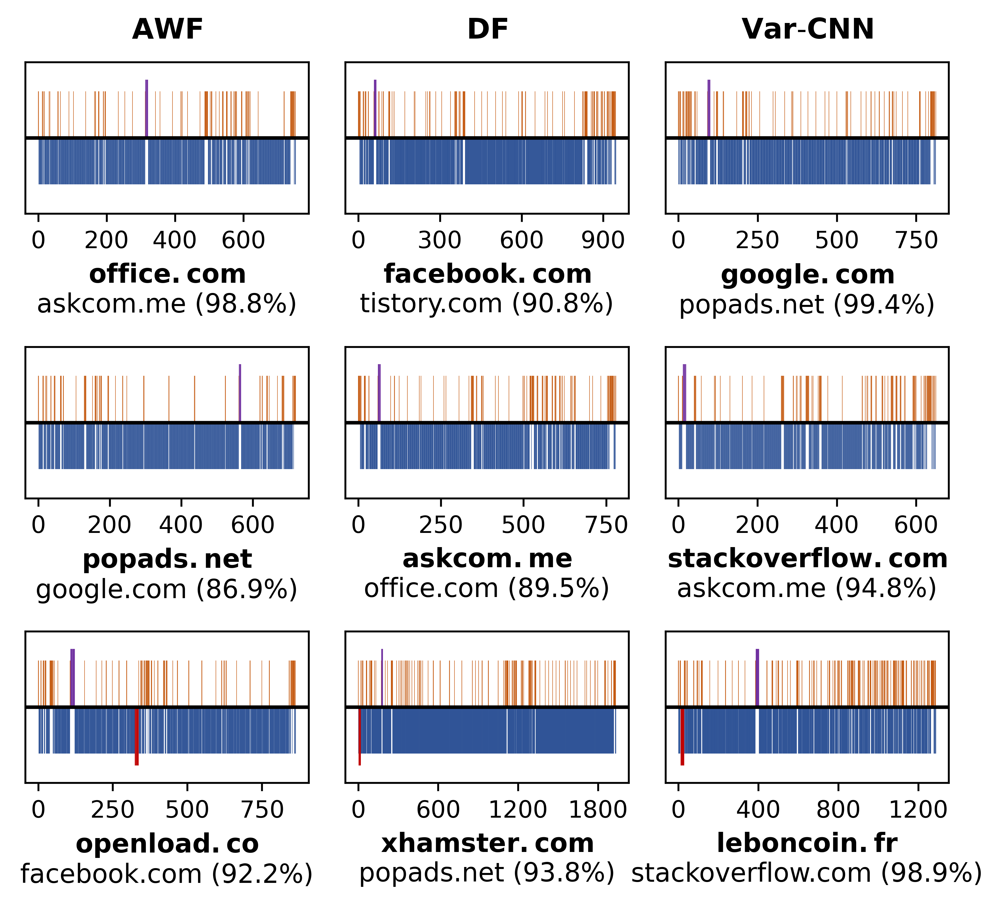

## *Minipatch*: Adversarial-based Website Fingerprinting Defense

***Minipatch*** is a lightweight defense against DNN-based Website Fingerprinting (WF) attacks, which works by perturbing the network traffic patterns with very few dummy packets.
***Minipatch*** involves a patch injection function to preserve the traffic pattern constraints and a patch generation approach that requires only black-box feedback of the target model.
The generated adversarial patches are website-oriented and can be pre-computed and applied to real-time traffic.
More importantly, ***Minipatch*** provides over 97% protection success rate with less than 5% bandwidth overhead, much lower than existing defenses.



:warning: ***Note:*** The code is for NON-COMMERCIAL RESEARCH USE ONLY!

### DATASET

We utilize the publicly available [Sirinam et al.](https://dl.acm.org/doi/10.1145/3243734.3243768)'s dataset and several datasets provided by [Rimmer et al.](https://distrinet.cs.kuleuven.be/software/tor-wf-dl/)

Please download the following datasets:

* Sirinam's ClosedWorld NoDef dataset (6 pkl files) from [here](https://drive.google.com/drive/folders/1JhP2mGKgUO6PsGTHl5eDB91NFPQyiJIs).
* Rimmer's Closed World and Concept drift datasets (9 npz files) from [here](https://github.com/DistriNet/DLWF).

After downloading, please put the data into `data/Sirinam` and `data/Rimmer` directories, respectively.

### USAGE

Use the argument `-h` to get the help message:

```
> python minipatch.py -h

usage: minipatch.py [-h] [-t] [-m MODEL] [-d DATA] [-nw WEBSITES]
                    [-ns SAMPLES] [-vm VERIFY_MODEL] [-vd VERIFY_DATA]
                    [--patches PATCHES] [--inbound INBOUND]
                    [--outbound OUTBOUND] [--adaptive] [--maxiter MAXITER]
                    [--threshold THRESHOLD] [--polish] [--verbose VERBOSE]

Minipatch: Undermining DNN-based Website Fingerprinting with Adversarial Patches

optional arguments:
  -h, --help            show this help message and exit
  -t, --train           Training DNN model for Deep Website Fingerprinting.
  -m MODEL, --model MODEL
                        Target DNN model. Supports ``AWF``, ``DF`` and
                        ``VarCNN``.
  -d DATA, --data DATA  Website trace dataset. Supports ``Sirinam`` and
                        ``Rimmer100/200/500/900``.
  -nw WEBSITES, --websites WEBSITES
                        The number of websites to perturb. Take all websites
                        if set to -1.
  -ns SAMPLES, --samples SAMPLES
                        The number of trace samples to perturb. Take all
                        samples if set to -1.
  -vm VERIFY_MODEL, --verify_model VERIFY_MODEL
                        Validation Model. Default is the same as the target
                        model.
  -vd VERIFY_DATA, --verify_data VERIFY_DATA
                        Validation data. Default is the validation data.
                        Supports ``3d/10d/2w/4w/6w`` with ``Rimmer200``.
  --patches PATCHES     The number of perturbation patches.
  --inbound INBOUND     The maximum packet number in incoming patches. Perturb
                        outgoing packets only if set to 0.
  --outbound OUTBOUND   The maximum packet number in outgoing patches. Perturb
                        incoming packets only if set to 0.
  --adaptive            Adaptive tuning of patches and bounds for each
                        website.
  --maxiter MAXITER     The maximum number of iteration.
  --threshold THRESHOLD
                        The threshold to determine perturbation success.
  --polish              Perform local search at each iteration.
  --verbose VERBOSE     Print out information. 0 = progress bar, 1 = one line
                        per item, 2 = show perturb details.
```

### STEP 1: Training Target DNN Models

We challenge the protection performance of ***Minipatch*** against three state-of-the-art DNN-based WF attacks: [AWF](https://distrinet.cs.kuleuven.be/software/tor-wf-dl/), [DF](https://dl.acm.org/doi/10.1145/3243734.3243768), and [Var-CNN](https://www.sciendo.com/article/10.2478/popets-2019-0070).
We adopt an early stopping strategy and a sufficient maximum number of training epochs to adequately train the model.
The training process terminates only when the validation loss does not decrease for a specific number of epochs, and the final model is derived from the epoch with the lowest loss.

Use the argument `-t` to train a model. For example, to train the DF attack on the Sirinam dataset, use the following command:

```
> python minipatch.py -t -m DF -d Sirinam
```

### STEP 2: Generating *Minipatch* Perturbations

Use commands without argument `-t` to generate ***Minipatch*** perturbations.

For example, to generate perturbations comprising a maximum of 8 patches of length up to 64, use the following command:

```
> python minipatch.py -m DF -d Sirinam --patches 8 --inbound 64 --outbound 64 --adaptive --maxiter 30
```

Set the argument `--inbound` to 0 to generate one-way client-side perturbations:

```
> python minipatch.py -m DF -d Sirinam --patches 8 --inbound 0 --outbound 64 --adaptive --maxiter 30
```

Use the argument `-vd` to evaluate the effect of concept drift:

```
> python minipatch.py -m DF -d Sirinam --patches 8 --inbound 64 --outbound 64 --adaptive --maxiter 30 -vd 10d
```

Use the argument `-vm` to evaluate the perturbation transferability:

```
> python minipatch.py -m DF -d Sirinam --patches 8 --inbound 64 --outbound 64 --adaptive --maxiter 30 -vm VarCNN
```

### CONTECT US

Feel free to contact us with any questions or feedback about our research.

* Ding Li ([liding17@outlook.com](liding17@outlook.com))
* Yuefei Zhu ([yfzhu17@sina.com](yfzhu17@sina.com))
* Minghao Chen ([1069304038@qq.com](1069304038@qq.com))
* Jue Wang ([eleva980427@sina.com](eleva980427@sina.com))

